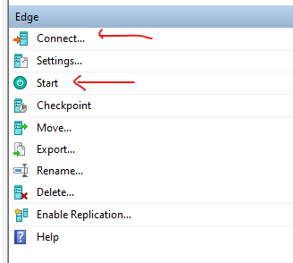

# CSC8110 Cloud Computing – Assessment 1

This repository contains essential materials and references for the practicals of CSC8110 Cloud Computing module.

## Table of Contents

* [Getting started (Azure lab)](#getting-started-azure-lab)
	* [Azure lab troubleshooting](#azure-lab-troubleshooting)
* [Getting started (Local virtual machine)](#getting-started-local-vm)
	* [Local VM troubleshooting](#local-vm-troubleshooting)

## Getting started (Azure lab)

1. Access Azure lab
    * Go to [Azure lab](https://labs.azure.com/), login with your student account
        * Use this (c12345678@newcastle.ac.uk) email, not this (a.a.name1@newcastle.ac.uk) email
    * Click the icon next to the VM power button

2. Setup remote connection
    * Download the .rdp file by clicking the blue computer icon
    * Login for the VM (Both Windows and Ubuntu)
        * Username: student
        * Password: CSC8110!
    * For Windows
        * Directly run the file with remote desktop connection
    * For Mac
        * Download [Microsft Remote Desktop](https://apps.apple.com/us/app/microsoft-remote-desktop/id1295203466?mt=12) from the App Store
    * For Linux
        * Install any RDP client from your package manager
        * When logging in, make sure the username is `student` and not `~\student`

3. Access the Ubuntu VM
	* Once you logged into the Windows desktop, open the Hyper-V Manager
	* Click these two buttons to start and connect to the VM
		* 

### Azure lab troubleshooting

* Cannot connect to the lab, or no Internet connection in the lab
	* At the Azure lab page, click the 3 dot menu next to the connect button. Then click "Redeploy"
* Reset the lab for any reason?
	* At the Azure lab page, click the 3 dot menu next to the connect button. Then click "Reimage"
 	* 
* "'Cloud' failed to restore" when starting the VM in Hyper-V
	* Click "Delete saved state" on the Cloud VM
 	* 
* Accidentally deleted the Ubuntu VM
	* Refer to [this link](restore-vm.md)

## Getting started (Local VM)

We provide the following images for the coursework as an alternative to Azure lab. Both links requires you to login to your school account to download

* For x86_64
    * [Download this image](https://newcastle-my.sharepoint.com/:u:/g/personal/nwhs3_newcastle_ac_uk1/EaJqrUewQExKv_qbtoo2KkUBPGwijmb3D-PRS-lD2bBXSA?e=QfXbU7)
    * Prerequisites:
        * Install VMWare player / VMWare workstation, VMWare fusion for Macs
        * Windows, Linux and Intel Macs
        * 30 GB+ storage
* For arm64
    * [Download this image](https://newcastle-my.sharepoint.com/:u:/g/personal/nwhs3_newcastle_ac_uk1/EYbVeRLv3VROs74YSxU8dcMBd4d7dMsT-do6UFdbQO0YYA?e=Nbd6ma)
    * Prerequisites:
        * Install [UTM](https://getutm.app/)
        * ARM Macs only (e.g, M1, M2, etc.)
        * macOS Sequoia/macOS 15 and above
        * 70 GB storage
        * Rosetta
            * In a terminal, type `sudo softwareupdate --install-rosetta`

## Local VM troubleshooting

* [ARM Macs only] No Internet access / kubectl timeout in the VM
	* Power off, then edit the VM
 	* At the network section, change the network mode to "Shared"
  	* If that doens't work, switch it back to "Bridge" and try a different network interface
    

