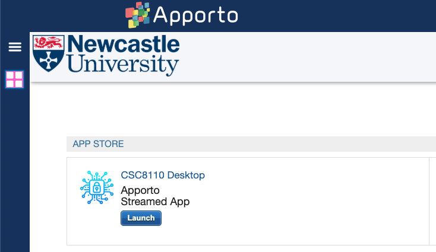
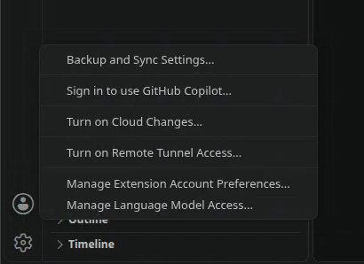

# Apporto platform

## Getting started

Go to <https:://ncl.apporto.com> and login with your school account.

Click Launch to connect

## Launching applications

You can launch the following GUI applicaitons from the VM:

* VSCode
  * Type `code` in the terminal to launch VSCode
* Firefox
  * Type `firefox` in the terminal to launch Firefox

## File transfer from your computer

This uses VS Code's Remote Tunnels feature to connect VS Code on your own computer to the Apporto VM, so you can transfer files between them.

> [!IMPORTANT]
> You will need VS Code installed on your OWN computer for this to work.

1. **In the Apporto VM**, launch VS Code and install the **Remote Tunnels** extension from the Extensions Marketplace.
2. **In the Apporto VM**, click the account icon in the bottom-left corner of VS Code and select **Turn on Remote Tunnel Access...**

    

3. Select **Install as a service**. Choose "use weak encryption" if prompted.
 > [!NOTE]
 > You can use your personal account for this step.
4. Choose either **Sign in with GitHub** or **Sign in with Microsoft**
5. Wait until VS Code reports that the tunnel is active (you'll see a notification, and the account icon will show a green tunnel indicator)
6. **On your own computer**, Open the Command Palette (`Ctrl+Shift+P` / `Cmd+Shift+P`) and run **Remote Tunnels: Connect to Tunnel...**
    * Sign in with the same account you used in the Apporto VM
    * Select the VM's tunnel from the list (it will be named after the VM's hostname)
7. Once connected, open the folder you want to work with on the VM (e.g. **File > Open Folder...**)
8. You can now drag and drop files between your computer and the VM directly in the VS Code Explorer, or use the integrated terminal to copy files across
